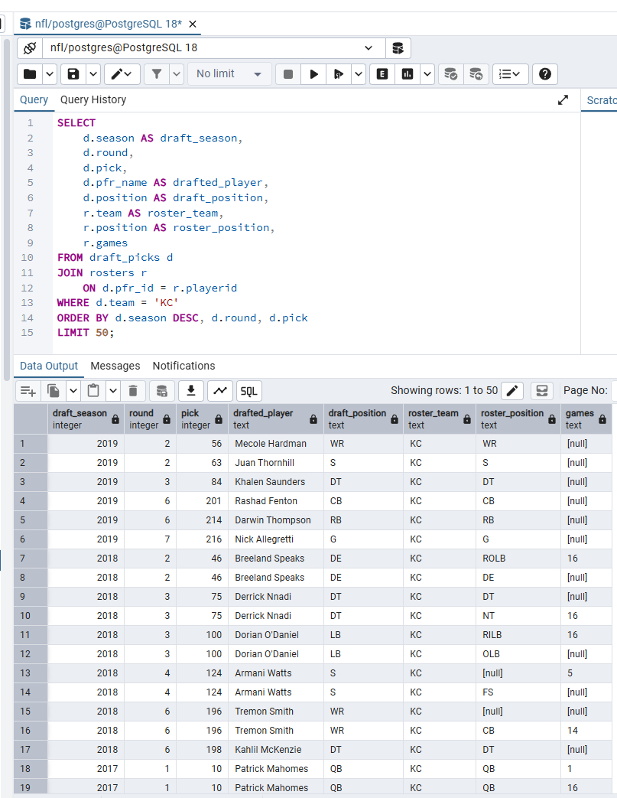

# Module 7 Database Project - NFL Data

## Project Overview

For this project, I created a PostgreSQL database containing NFL data.
The database contains information about NFL games, player rosters, and
NFL draft picks. I used PostgreSQL and pgAdmin 4 to create the database,
create the tables, import the source data, verify the data, and perform
SQL analysis.

## Initial Data Source

The data for this project came from the nflverse NFL data repository on GitHub.

- [NFL Games Data](https://github.com/nflverse/nfldata/blob/master/data/games.csv)
- [NFL Rosters Data](https://github.com/nflverse/nfldata/blob/master/data/rosters.csv)
- [NFL Draft Picks Data](https://github.com/nflverse/nfldata/blob/master/data/draft_picks.csv)

The project uses three CSV files:

- `games.csv`
- `rosters.csv`
- `draft_picks.csv`

## Data Files and Dimensions

| Table | Rows | Columns |

| games | 7,548 | 46 |
| rosters | 28,617 | 12 |
| draft_picks | 12,253 | 10 |

The database exceeds the project requirement of three tables, with at
least one table containing 1,000 rows and two additional tables
containing at least 100 rows.

## Data Dictionary

The NFL database contains three tables: `games`, `rosters`, and
`draft_picks`.

### Games Table

| Column | Data Type | Description |

| game_id | TEXT | Unique identifier for the NFL game |
| season | INTEGER | NFL season |
| game_type | TEXT | Type of game |
| week | INTEGER | Week of the NFL season |
| gameday | DATE | Date the game was played |
| weekday | TEXT | Day of the week |
| gametime | TEXT | Scheduled game time |
| away_team | TEXT | Away team abbreviation |
| away_score | INTEGER | Away team's final score |
| home_team | TEXT | Home team abbreviation |
| home_score | INTEGER | Home team's final score |
| location | TEXT | Game location designation |
| result | INTEGER | Difference in the game score |
| total | INTEGER | Combined points scored |
| overtime | INTEGER | Indicates overtime |
| roof | TEXT | Stadium roof type |
| surface | TEXT | Playing surface |
| temp | NUMERIC | Game temperature |
| wind | NUMERIC | Wind measurement |
| away_qb_name | TEXT | Away starting quarterback |
| home_qb_name | TEXT | Home starting quarterback |
| away_coach | TEXT | Away team's coach |
| home_coach | TEXT | Home team's coach |
| referee | TEXT | Game referee |
| stadium_id | TEXT | Stadium identifier |
| stadium | TEXT | Stadium name |

The `games` table also contains identifiers, rest-day information,
betting lines, betting odds, and quarterback identifiers.

### Rosters Table

| Column | Data Type | Description |

| season | TEXT | NFL season associated with the roster |
| team | TEXT | Team abbreviation |
| playerid | TEXT | Player identifier |
| full_name | TEXT | Player's full name |
| name | TEXT | Player name |
| side | TEXT | Offensive or defensive side |
| category | TEXT | Player category |
| position | TEXT | Player position |
| games | TEXT | Games played |
| starts | TEXT | Games started |
| years | TEXT | Player experience |
| av | TEXT | Approximate value field |

### Draft Picks Table

| Column | Data Type | Description |

| season | INTEGER | Draft season |
| team | TEXT | Team making the draft selection |
| round | INTEGER | Draft round |
| pick | INTEGER | Overall draft pick |
| pfr_id | TEXT | Pro Football Reference player identifier |
| pfr_name | TEXT | Player name |
| player_id | TEXT | Additional player identifier |
| side | TEXT | Offensive or defensive side |
| category | TEXT | Player category |
| position | TEXT | Player position |

## Database Creation and Installation

I downloaded all three NFL CSV files from the public GitHub repository specifically from the nflverse/nfldata. These three CSV files are games.csv, rosters.csv, and draft_picks.csv

I created a new PostgreSQL database named NFL using pgAdmin4. I then used tools inside PostgreSQl to connect the nfl database to the three tables: games, rosters, and draft_picks.


## Challenges and Solutions

I ran into issues when importing and found that I needed to change the CSV import settings to the following:

- Format: CSV
- Encoding: UTF-8
- Header: Yes
- Delimiter: comma
- Quote character: double quotation mark
- Escape character: double quotation mark


## Table Structure and Data Types

I created the tables in such a way that it would match the NFL data sets that I downloaded.

Examples include:

| Table | Column | Data Type | Purpose |

| games | gameday | DATE | Date the NFL game was played |
| games | season | INTEGER | NFL season |
| games | week | INTEGER | Week of the season |
| games | home_score | INTEGER | Home team's score |
| games | away_score | INTEGER | Away team's score |
| games | spread_line | NUMERIC | Betting spread |
| games | temp | NUMERIC | Game temperature |
| games | home_team | TEXT | Home team abbreviation |
| games | away_team | TEXT | Away team abbreviation |
| games | stadium | TEXT | Stadium name |
| draft_picks | season | INTEGER | Draft season |
| draft_picks | round | INTEGER | Draft round |
| draft_picks | pick | INTEGER | Overall draft pick |
| draft_picks | pfr_name | TEXT | Drafted player's name |
| rosters | playerid | TEXT | Player identifier |
| rosters | full_name | TEXT | Player's full name |
| rosters | position | TEXT | Player position |

## Data Verification

After each table was uploaded I verified with PostgreSQL commands to ensure that it had the proper amount of rows displayed. I finally verified the PostgreSQL table structures with the following query:

```sql
SELECT
    table_name,
    column_name,
    data_type
FROM information_schema.columns
WHERE table_schema = 'public'
  AND table_name IN ('games', 'rosters', 'draft_picks')
ORDER BY table_name, ordinal_position;
```


This query returned 68 columns across the three tables and confirmed
that the database contains `DATE`, `INTEGER`, `NUMERIC`, and `TEXT`
data types.


### Games

The games table contains 7548 rows and 46 columns. You can further do analysis with the following:

```sql
SELECT *
FROM games
LIMIT 10;
```

This will allow you to display a sample NFL records including; season, game date, teams, scores, quarterbacks, coaches, stadium, and other game information.

### Rosters

The rosters table contains 28617 rows and 12 columns. You can further do analysis with the following:

```sql
SELECT *
FROM rosters
LIMIT 10;
```

This will allow you to display sample rosters including; season, team, player name, position, games, and starts.

### Draft Picks

The draft picks table contains 12253 rows and 10 columns. You can further do analysis with the following:

```sql
SELECT *
FROM draft_picks
LIMIT 10;
```

This will allow you to display sample draft picks including: season, team, round, overall pick, player, and position.

## SQL Analysis

I was able to explore additional data once the tables were joined for information that was not immediately visible through the original CSV files. This allowed me to obtain some data that I will list below.

### Kansas City Chiefs Wins by Season

I was able to view Kansas City Chiefs wins by season with the following coding

```sql
SELECT
    season,
    COUNT(*) AS chiefs_wins
FROM games
WHERE
    (home_team = 'KC' AND home_score > away_score)
    OR
    (away_team = 'KC' AND away_score > home_score)
GROUP BY season
ORDER BY season DESC;
```


I had to use the where or statements properly in order to get the full amount of wins for the chiefs each season. I couldn't find a way to do it without this where/or statement. The Group by allowed me to see the wins specifically per season. One thing to note on this data, is the wins for the current season is incomplete. If you were to do further analysis you should not include the current season so that you do not skew your results.

### Joining Draft Picks and Rosters

I think this is one of the most useful sections for data analysis within the NFL. I first tried to match the draft_picks.player_id to the rosters.playerid which returned zero matching rows. I then looked further at the data I had and tried draft_picks.pfr_id with rosters.playerid with the following code:

```sql
SELECT
    COUNT(*) AS matching_players
FROM draft_picks d
JOIN rosters r
    ON d.pfr_id = r.playerid;
```




This gave me 19818 matching rows which showed that these fields could be used to connect the two tables. I then wanted to display these for the Kansas City Chiefs so I used the code:

```sql
SELECT
    d.season AS draft_season,
    d.round,
    d.pick,
    d.pfr_name AS drafted_player,
    d.position AS draft_position,
    r.team AS roster_team,
    r.position AS roster_position,
    r.games
FROM draft_picks d
JOIN rosters r
    ON d.pfr_id = r.playerid
WHERE d.team = 'KC'
ORDER BY d.season DESC, d.round, d.pick
LIMIT 50;
```


This displayed the player's draft season, draft round, overall pick, name and position with other information from the roster table. *NOTE* some players appear more than once because they can have many records in the roster data.

## Insights and Conclusions

This was a fun project that allowed me to find a public dataset, use that public dataset to create a PostgreSQL database, import CSV data, validate records, and conduct data analysis with SQL.

The final NFL database contains three tables and 48418 total records. The games table contains 7548 records, rosters table contains 28617 records, and the draft picks table contains 12253 records.

One of the most important lessons I learned is when importing the CSV file the data must be examined fully before importing it into a database. I had to correct the table structure to allow the data to be imported without discarding the records.

The Kansas City Chiefs analysis demonstrated how game records can be combined in a way to give season statistics. I did this by searching games based on home and away teams and then grouping them together to form the correct season. In doing so I was able to get the number of wins per season for each season in the dataset.

I enjoyed this project as a learning tool because it helped me to validate, join, use aggregation, and queries to form a database and analysis together.
